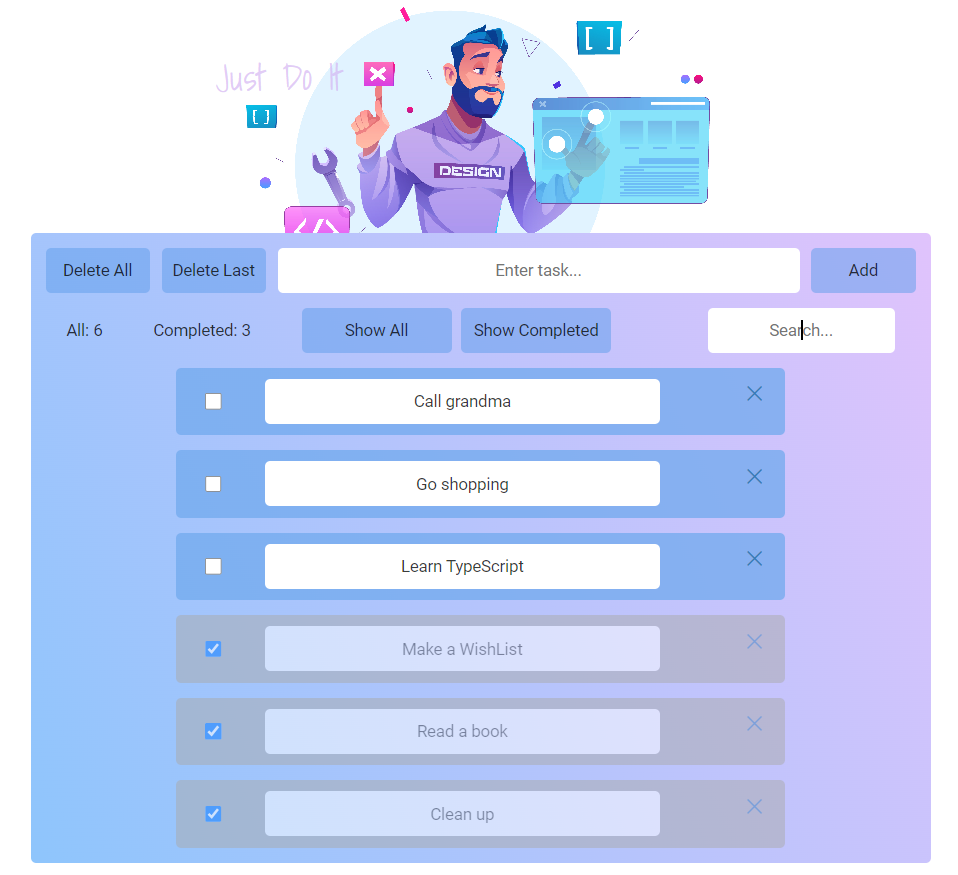

# <a href='https://github.com/PetrovaValerie/task-manager'> Task Manager </a> 

  <!-- DESCRIPTION -->
  
The user can:

- track tasks

- complete / delete tasks

- click onto the completed tasks

- search for specific tasks

All actions have been saved in the localStorage. 

  
Task Manager App using vanilla JavaScript
   
<!--    -->
  

  
  

